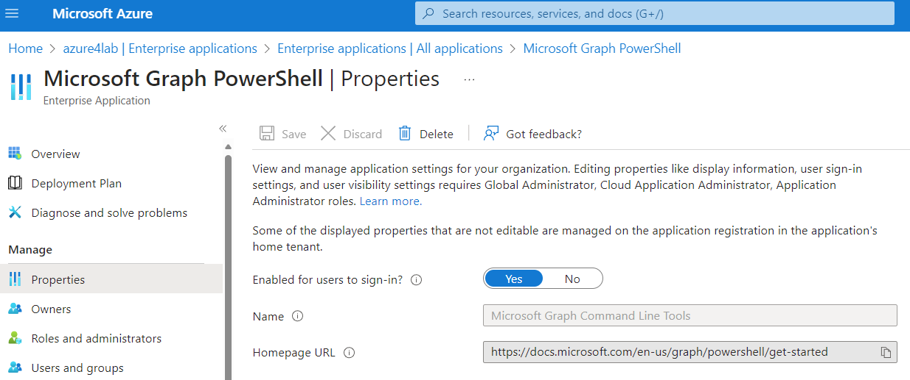

# MTTCoHack-Arc

## Setup instructions HVHOST environment

Deploy Arc lab to Azure:

[](https://portal.azure.com/#create/Microsoft.Template/uri/https%3A%2F%2Fraw.githubusercontent.com%2Fjkulbe-msft%2FMTTCoHack-Arc-coach%2Fmain%2Fazuredeploy.json)


## Setup instructions Azure environment

1. Download files from the Setup folder.

2. Connect to Azure with a **Global Admin** and an **Owner** account.

3. Start Azure CloudShell

4. Upload files downloaded from Setup folder to CloudShell. 

5. If you have many subscriptions, set the subscription where you are going to deploy the environment. For this, you can use the cmd "AZ-SetContext".
    
    ```powershell
    Set-AzContext -SubscriptionId "79c2a240-1a7f-482f-a315-xxxxxxxxx"
    ```

6. Run the script deploy.ps1 by specifying the region where you want to deploy the environment.
     
     ```powershell
    .\MTTCoHackArc_AzureSetup.ps1 -region 'northeurope'
    ```
  
   >**Note**: You have to authenticate with an owner account to Microsoft Graph by following the instructions displayed on the console. Don't walk away from the console until the deployment is done.
   >

   >**Note**: If you got an error about Microsoft Graph, you may need to delete the application "Microsoft Graph PowerShell" in the menu "enterprise app"
   >

7. Once the deployment is done, store credentials information to share them with attendees:
    

## Clean up

1. Start **Windows PowerShell** as an **Administrator** on your local Hyper-V host.

2. Run the script MTTCoHackArc_HyperVRemove.ps1 from the setup folder
    ```powershell 
    .\MTTCoHackArc_HyperVRemove.ps1
    ```

2. Start Cloudshell

3. Run the script remove.ps1 in the Setup folder
  ```powershell
    .\MTTCoHackArc_AzureRemove.ps1
    ```