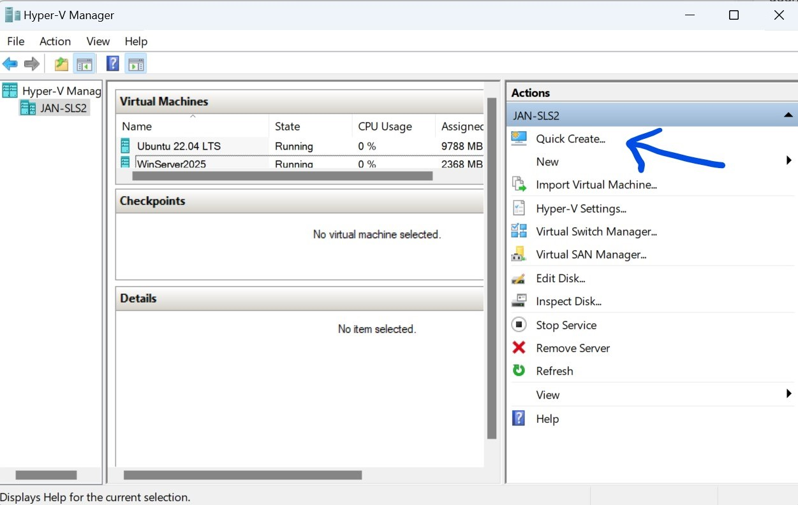
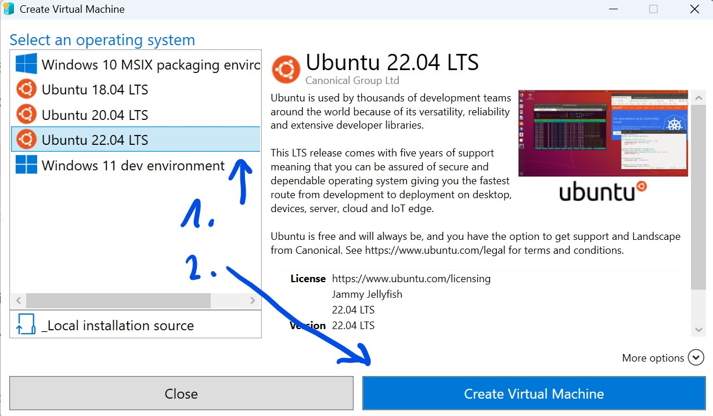
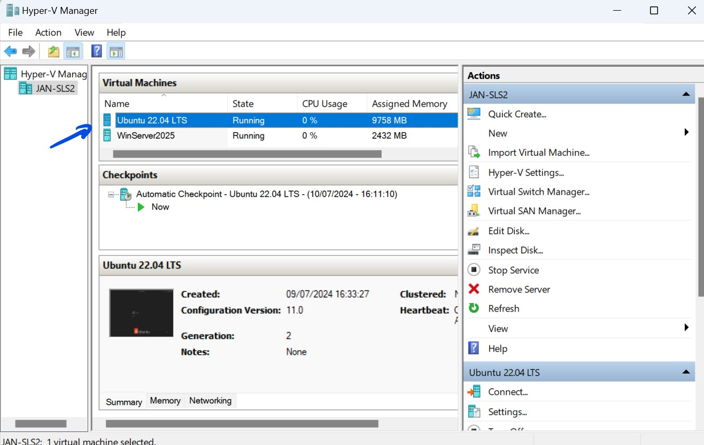

# MTTCoHack-Arc

## Setup instructions local environment

1. Download files from the Setup folder to a local machine with Hyper-V. 32 GB RAM recommended.

2. Start **Windows PowerShell** as an **Administrator**.

3. Run the script from the setup folder
    ```powershell 
    .\MTTCoHackArc_HyperVSetup.ps1
    ```

4. The script will set up a simulated data center with the following machines:
   - **DC1** - Windows Server 2022, Domain Controller
   - **SRV1** - Windows Server 2022, SQL Server 2022
  Note the indicated user name and password.

5. Open Hyper-V Manager and click on **"Quick Create..."** in the Actions bar.
    >

6. Select "Ubuntu 22.04 LTS" and click on **"Create Virtual Machine"**.
   >
     
7. After deployment of the Linux machine, double click on it in the central pane to open the console and follow the instructions to set up a **user** and **password** on the Linux machine. You can use the same user name and password as for the Windows machines.
   >
   

## Setup instructions Azure environment

1. Download files from the Setup folder.

2. Connect to Azure with a **Global Admin** and an **Owner** account.

3. Start Azure CloudShell

4. Upload files downloaded from Setup folder to CloudShell. 

5. If you have many subscriptions, set the subscription where you are going to deploy the environment. For this, you can use the cmd "AZ-SetContext".
    
    ```powershell
    Set-AzContext -SubscriptionId "79c2a240-1a7f-482f-a315-xxxxxxxxx"
    ```

6. Run the script deploy.ps1 by specifying the region where you want to deploy the environment.
     
     ```powershell
    .\MTTCoHackArc_AzureSetup.ps1 -region 'northeurope'
    ```
  
   >**Note**: You have to authenticate with an owner account to Microsoft Graph by following the instructions displayed on the console.
   >

   >**Note**: If you got an error about Microsoft Graph, you may need to delete the application "Microsoft Graph PowerShell" in the menu "entreprise app"
   >

7. Once the deployment is done, store credentials information to share them with attendees:
    

## Clean up

1. Start **Windows PowerShell** as an **Administrator** on your local Hyper-V host.

2. Run the script MTTCoHackArc_HyperVRemove.ps1 from the setup folder
    ```powershell 
    .\MTTCoHackArc_HyperVRemove.ps1
    ```

2. Start Cloudshell

3. Run the script remove.ps1 in the Setup folder
  ```powershell
    .\MTTCoHackArc_AzureRemove.ps1
    ```