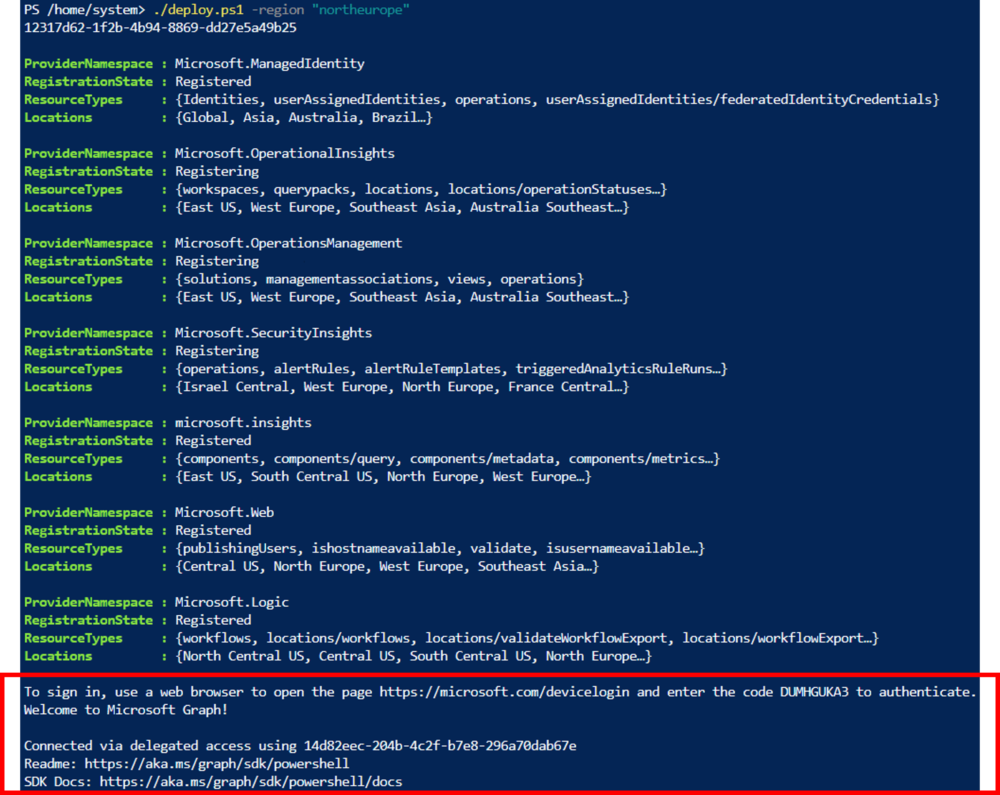

# MTTCoHack-Arc

## Setup instructions Azure environment

1. Download files from the Setup folder.

2. Connect to Azure with a **Global Admin** and an **Owner** account.

3. Start Azure CloudShell

4. Upload files downloaded from Setup folder to CloudShell. 

5. If you have many subscriptions, set the subscription where you are going to deploy the environment. For this, you can use the cmd "AZ-SetContext".
    
    ```powershell
    Set-AzContext -SubscriptionId "79c2a240-1a7f-482f-a315-xxxxxxxxx"
    ```

6. Run the script deploy.ps1 by specifying the region where you want to deploy the environment.
     
     ```powershell
    .\MTTCoHackArc_AzureSetup.ps1 -region 'northeurope'
    ```
  
   >**Note**: You have to authenticate with an owner account to Microsoft Graph by following the instructions displayed on the console. Don't walk away from the console until the deployment is done.
   >

   >**Note**: If you got an error about Microsoft Graph, you may need to delete the application "Microsoft Graph PowerShell" in the menu "enterprise app"
   >

7. Once the deployment is done, store credentials information to share them with attendees

## Setup instructions HVHOST environment

1. Deploy Arc lab to Azure using the following button. You can deploy into resource group rg-cohackArc or a separate one if you want to keep the resources separate.
    
    [](https://portal.azure.com/#create/Microsoft.Template/uri/https%3A%2F%2Fraw.githubusercontent.com%2Fjkulbe-msft%2FMTTCoHack-Arc-coach%2Fmain%2Fazuredeploy.json)
   
   This will set up a Hyper-V host **HVHOST** with the following VMs:
   - **DC1**: Domain Controller running Windows Server 2022 without GUI
   - **SRV1**: Windows Server 2022 with SQL Server 2022, joined to the domain corp.contoso.com
   - **LIN1**: Ubuntu Linux 24.04, standalone 

    DC1 and SRV1 are joined to the domain corp.contoso.com. The domain admin account is `corp\administrator` with the password `Somepass1`.

2. Sign in to HVHOST using RDP, open the Hyper-V console, connect to LIN1 and finish the setup by accepting the default settings. Create a user account and password and note it down.

3. Share the login details for HVHOST, DC1, SRV1 and LIN1 with the attendees.

## Solution
1. Share the credentials for **HVHOST** with the attendees.
2. Share the credentials for **DC1**, **SRV1** and **LIN1** with the attendees.
3. Share the credentials for the Azure environment with the attendees.
4. Remind attendees that **HVHOST** should **not** be onboarded to Azure Arc.

### Challenge 1: Onboard on-prem servers to Azure Arc
1. Log on to HVHOST using the provided credentials. Open Hyper-V manager. If DC1, SRV1, and LIN1 are not running, start them.
2. In Hyper-V manager on HVHOST, connect to SRV1. Use a supported region for Arc-enabled SQL Server. Choose any of these methods to onboard the server to Arc:
    - Launch Arc Setup from server manager 
    - Launch Arc Setup from the start menu 
    - Launch Arc setup from the system tray icon 
3. For DC1, log on to the Azure portal, navigate to Azure Arc, click on "Add resources/Add a machine/Add a single server", then follow the prompts. Run the generated script on DC1 and sign in to Azure using the machine flow when prompted.
4. For LIN1 log on to the Azure portal, navigate to Azure Arc, click on "Add resources/Add a machine/Add a multiple servers", then follow the prompts. Create a service principal when prompted and note down the details. Fill in the details in the generated script. Run the generated script on DC1
    - The service principal should be created in the resource group and in the interest of security have a 1 day secret lifetime and only the *"Azure Connected Machine Onboarding"* role.
5. Verify that all servers are onboarded to Azure Arc by checking the Azure portal.

### Challenge 2: Manage and govern your on-prem resources at scale
- Enable Insights from the Azure portal under Azure Arc Machines/Monitoring
  - When creating the Data Collection Rule (DCR), ensure that network and process info is selected and the DCR is connected to the pre-created Log Analytics workspace in rg-cohackArc.
  - all machines can use the same DCR
- SQL: on Arc machines/SRV1/Extensions, check if SQL extension is present. If not, add the extension manually using the "add" button. Select license type "LicenseOnly".
- In Azure Policy, find the policy "Configure periodic checking for missing system updates on azure Arc-enabled servers"
  - assign the policy to the RG
  - enable a remediation task to fix existing machines
- Updates: Open Azure Update Manager
  - Select all 3 machines, run "check for updates"
  - Select all 3 machines, run "schedule updates"
  
### Challenge 3: Use Defender for Cloud to get recommendations for your on-prem servers
- see the recommendations from Defender for Cloud or Arc machines/Security
### Challenge 4: manage your SQL Server using Azure Arc from the Azure portal
- Licensing: go to Arc machines/SRV1/SQL Server Configuration
- Entra login: go to Arc/Data services/SQL Server instances/Settings/Microsoft Entra ID, set admin
- Best practices assessment: go to Arc/Data services/SQL Server instances/Best practices assessment

## Clean up

1. Start **Windows PowerShell** as an **Administrator** on your local Hyper-V host.

2. Start Cloudshell

3. Run the script remove.ps1 in the Setup folder
    ```powershell
      .\MTTCoHackArc_AzureRemove.ps1
    ```

4. Delete any service pricipals created during the lab